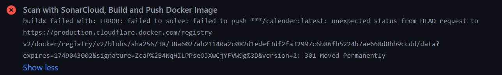

# 📅 Calender - A React Web Application with CI/CD

A full-stack event calendar application built with the MERN stack (MongoDB, Express.js, React.js, Node.js) and deployed via a comprehensive CI/CD pipeline to Google Cloud Platform.

This application utilizes <a href="https://github.com/intljusticemission/react-big-calendar"> react-big-calendar </a> and 
<a href="https://github.com/YouCanBookMe/react-datetime"> react-datetime </a> components to add and remove events to a calendar.

It also showcases the use of <a href="https://github.com/localForage/localForage"> localForage </a> to store the calendar events for offline use as well as to retrieve it in future instancesCalender - A React Web Application with CI/CD

## 🙏 Acknowledgements
The foundational calendar application was forked from the excellent **[react-calendar-events-example](https://github.com/yasnaraj/react-calendar-events-example)** repository created by **[@yasnaraj](https://github.com/yasnaraj)**.

We extend our gratitude for their foundational work which provided the core application structure and features. Our contributions to this project focused on building new features and documenting a comprehensive CI/CD pipeline on top of this foundation, including automated testing, quality gates with SonarCloud, containerization with Docker, and deployment to Google Cloud Platform.

## 📲 Installation:
**1. Clone the Repository:**
```sh
git clone https://github.com/diawyx/calender
cd calender
```
**2. Install Dependencies (with NPM):**
```sh
npm install
```


## 📋 Table of Contents
1.  [About The Project](#1-about-the-project)
2.  [Technology Stack](#2-technology-stack)
3.  [Key Features](#3-key-features)
4.  [The CI/CD Pipeline](#4-the-cicd-pipeline)
    * [CI Workflow (ci.yml)](#41-ci-workflow-ciyml---scan-build--push)
    * [CD Workflow (cd.yml)](#42-cd-workflow-cdyml---deploy-to-google-cloud-run)
5.  [Development Journey & Challenges](#5-development-journey--challenges)
6.  [Future Work](#6-future-work)

## 1. About The Project
This document outlines the development process and the implementation of a comprehensive Continuous Integration and Continuous Deployment (CI/CD) pipeline for the "Calender" web application. The primary goal of this project was not only to build a functional event calendar application but also to establish a robust, automated workflow to ensure code quality, consistency, and rapid, reliable delivery of new features.

The pipeline automates the entire process from code analysis to building a containerized artifact and deploying it across multiple environments on Google Cloud Platform.

## 2. Technology Stack
| Category | Technology | Description |
| :--- | :--- | :--- |
| 🌐 **Frontend** | React.js | A declarative UI library for building user interfaces. |
| | CSS & HTML | For styling and structuring the web content. |
| ⚙️ **Backend** | Node.js & Express.js | For building a fast and scalable server-side application and APIs. |
| | Multer & CORS | Key packages for handling file uploads and enabling cross-origin requests. |
| 🐳 **Containerization** | Docker & Nginx | The React frontend is served by an Nginx web server, all packaged within a Docker container for environmental consistency. |
| 🚀 **CI/CD & Deployment** | GitHub Actions | Orchestrator for the CI/CD pipeline, automating workflows for testing, building, and deploying. |
| | Jest | A JavaScript testing framework used to run unit and integration tests as part of the CI pipeline. |
| | SonarCloud | Used for static code analysis (SAST) to maintain code quality and detect bugs or vulnerabilities. |
| | Docker Hub | Acts as the registry for storing and distributing the containerized application (Docker image). |
| | Google Cloud Run | The serverless platform on GCP used for deploying and running the containerized application. |


## 3. Key Features
The application currently supports the following core features:
* 🗓️ **Event Calendar**: A primary interface for viewing, creating, and managing events.
* 📤 **File Upload System**: An API endpoint (`/upload`) for uploading files, managed by the Node.js backend.
* 🔔 **Notification System**: A feature to provide real-time notifications to users within the website.
* 🌙 **Dark Mode**: This feature allows user to operate the app better in a low-light condition.


## 4. The CI/CD Pipeline
We designed a decoupled CI/CD pipeline using GitHub Actions to automate the entire software delivery lifecycle. This pipeline is split into two distinct workflows: a CI workflow for integration and artifact creation, and a CD workflow for deployment.


### 4.1. CI Workflow (ci.yml) - Scan, Build, & Push

This workflow is responsible for code integration, quality assurance, and application packaging. It is triggered on every push and pull_request to the main branch. Its purpose is to validate the code and, if the validation is successful on the main branch, create a deployable Docker image artifact.

The CI workflow is now structured into two sequential jobs: `code-scan` and `build-and-push`.

**Trigger:** The workflow runs automatically on every push or pull_request to the main branch.

#### Job 1: code-scan
This job acts as our primary quality gate.

**1. Code Checkout:** The source code from the repository is downloaded to the GitHub Actions runner. `fetch-depth: 0` is used to retrieve the full commit history, which is required by SonarCloud for accurate analysis of new code.

**2. Install & Test:**
* **Tool:** `npm`
* **Process:** It runs `npm ci` for a clean installation of dependencies and then `npm test` to execute our automated tests. A code coverage report (`lcov.info`) is generated during this step.

**3. SonarCloud Scan:**
* **Tool:** SonarCloud
* **Process:** After tests pass, the SonarScanner is invoked. It performs static code analysis to detect bugs, vulnerabilities, and code smells. Crucially, it also uploads the test coverage report (`-Dsonar.javascript.lcov.reportPaths=coverage/lcov.info`) to provide insights into our test effectiveness. If the code fails to meet the defined Quality Gate standards in SonarCloud, this job will fail, and the entire pipeline will stop.

#### Job 2: build-and-push
This job is responsible for creating and publishing the application artifact.

**1. Condition & Dependency:** This job has a dependency (`needs: code-scan`) and a condition (`if: github.event_name == 'push' && github.ref == 'refs/heads/main'`). This means it will only start if the code-scan job succeeds AND the triggering event was a push to the main branch. This robustly prevents images from being built from Pull Requests or from code that failed the quality check.

**2. Build & Push to Docker Hub:**
* **Tools:** Docker, Docker Hub
* **Process:**
        1. Log in to Docker Hub using credentials stored in GitHub Secrets.
        2. A Docker image is built using the Dockerfile in the repository.
        3. The final image is pushed to Docker Hub with a single, unique tag based on the commit SHA for precise tracking and reliable deployments.

### 4.2. CD Workflow (cd.yml) - Deploy to Google Cloud Run

This workflow is focused entirely on deployment.
It is triggered automatically only after the CI workflow has completed successfully on the main branch.

**Trigger (workflow_run):** This workflow runs automatically when the CI Pipeline workflow has completed successfully on the main branch.

#### Job 1: deploy-testing
* **Tool:** Google Cloud Run
* **Purpose:** To deploy the Docker image from Docker Hub (using the specific commit SHA tag from CI) to an isolated "testing" environment on Google Cloud.
* **Process:**
        1. Authenticate to Google Cloud: Uses Workload Identity Federation for secure, keyless authentication.
        2. Deploy New Revision: Uses the deploy-cloudrun action to pull the image from Docker Hub and create a new revision on the testing Cloud Run service. This environment is configured to allow public access (--allow-unauthenticated) for easy access by the QA team.

#### Job 2: approve-production
* **Tool:** GitHub Environments
* **Purpose:** To act as a control gate before a production release.
* **Process:** The workflow will pause and await manual approval from a designated reviewer within the GitHub "Environments" settings. This ensures human oversight before changes go live to end-users.

#### Job 3: deploy-production
* **Tool:** Google Cloud Run
* **Condition:** This step only runs after manual approval has been given.
* **Purpose:** To deploy the application to end-users.
* **Process:**
        1. Authenticate to Google Cloud: The same authentication process, ideally using a separate, more restricted Service Account for production.
        2. Deploy New Revision: Uses the deploy-cloudrun action to deploy the exact same image (with the same commit SHA tag) that was validated in the testing environment. This guarantees consistency between what was tested and what is released.

## 5. Development Journey & Challenges
Throughout the implementation of this CI/CD pipeline, several technical challenges were encountered and successfully resolved.

### 5.1. SonarCloud Integration
- **Challenge:** Initial scanner failures due to invalid `SONAR_HOST_URL`, missing `SONAR_TOKEN`, and undefined sonar.`projectKey/sonar.organization` properties.


- **Solution:** We adopted SonarCloud for its hassle-free public hosting. The issues were resolved by correctly creating a token, storing it and other properties (`projectKey`, `organization`) as GitHub Secrets, and passing them as arguments in the workflow.

- **Challenge:** A conflict error, You are running CI analysis while Automatic Analysis is enabled, occurred.


- **Solution:** We disabled SonarCloud's "Automatic Analysis" feature, designating our GitHub Actions workflow as the sole analysis trigger.

### 5.2. Docker Hub Push Anomaly
- **Challenge:** A persistent `ERROR: 301 Moved Permanently` occurred when using docker/build-push-action to push two tags (latest and a commit SHA) in a single step.


- **Solution:** The issue was resolved by pushing only SHA-tagged image without the latest tag addition.

### 5.3. Google Cloud Run Deployment
- **Challenge:** The deployment failed with a `PERMISSION_DENIED: Permission 'iam.serviceAccounts.getAccessToken' denied error.`


- **Solution:** This was a Workload Identity Federation (WIF) issue. The resolution involved creating a dedicated Service Account for production and correctly assigning the "Workload Identity User" role to the GitHub Actions principal on that Service Account, allowing it to be impersonated.

- **Challenge:** The container failed to start with a `Default STARTUP TCP probe failed... on port 8080 error.`


- **Solution:** This was fixed by:
        1. Modifying the Node.js/Express backend to listen on 0.0.0.0 and respect the PORT environment variable (const PORT = process.env.PORT || 5000;).
        2. Creating a custom nginx.conf and using envsubst in the Dockerfile's CMD to dynamically set Nginx's listen port based on the PORT variable.
- **Challenge:** A deployed URL returned Error: Forbidden.
- **Solution:** The Cloud Run service was deployed with default private access. We resolved this by adding the --allow-unauthenticated flag to the deploy-cloudrun step in the workflow.

## 6. Future Work
The implemented CI/CD pipeline successfully automates the build, test, and deployment lifecycle. Future work will focus on:

* 🧪 Expanding the automated testing suite within the CI workflow.
* 📈 Implementing the planned monitoring stack with Prometheus and Grafana to gain better observability into the deployed application.